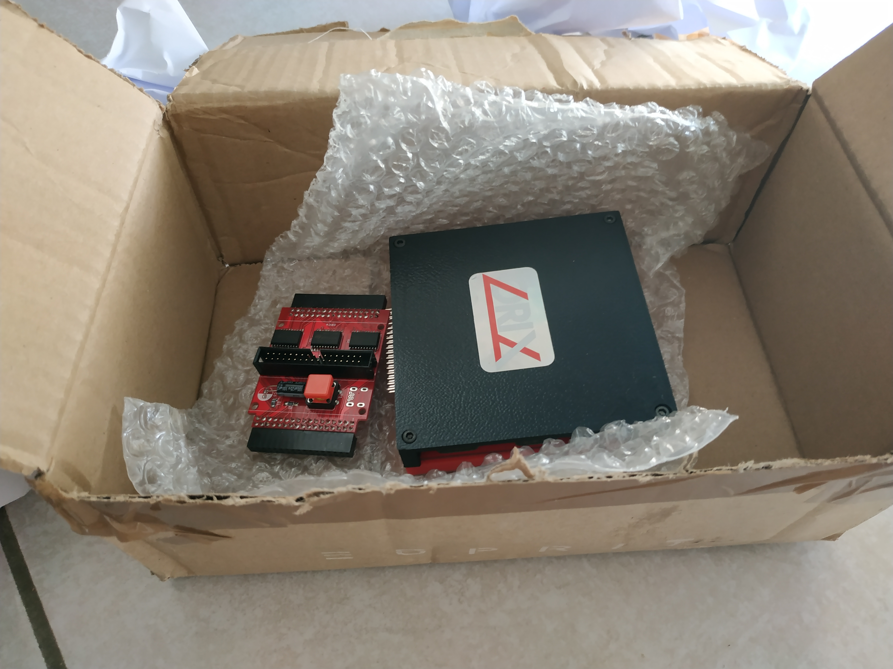
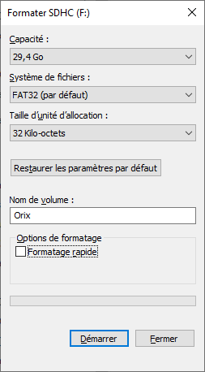
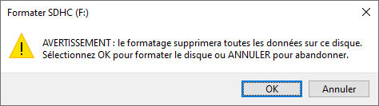
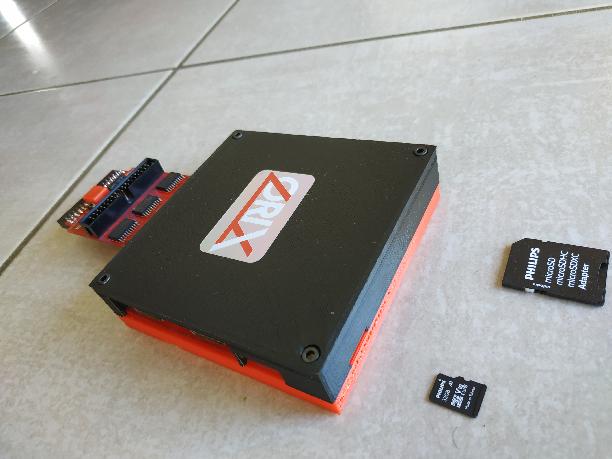
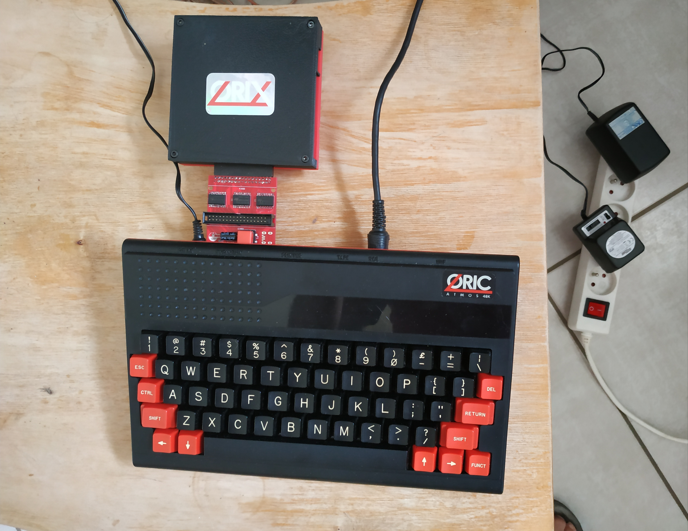

# Orixperience
[Orix](http://orix.oric.org/) est un systéme d'exploitation pour Oric créé par Jede et Assinie. Il vient avec la carte Twiligithe conçue et développée par Jede.

Le présent document se veut être un complément francophone au [manuel utilsateur de la carte d'extension Twilighte](http://orix.oric.org/twilighte-board-v0-6-user-manual/).

Il fournit les éléments facilitant la prise en main et la mise en oeuvre d'Orix grâce à la carte Twilighte.

Sont couverts les sujets de l'installation de la carte Twiligthe, de l'utilisation et du développement sur Orix.


## Guide d'installation

A réception de la carte.



La carte Twilighte accepte les cartes SD jusqu'à 32 Go.
Tous les modèles de cartes sont acceptés mais si vous voulez privilégier le matériel déjà validé par d'autres utilisateurs, voici une liste les cartes SD testées compatibles.

|Marque|Modèle|
|---|--|
|Phillips| A1 V10 32G|









## Guide d'utilisation

## Guide du programmeur

### Librairies et utilitaires
``` 
sudo apt install git

sudo apt-get install gcc

sudo apt-get install make
```

```
sudo apt install libsdl2-2.0-0 libsdl2-gfx-1.0-0 libsdl2-image-2.0-0 libsdl2-mixer-2.0-0 libsdl2-net-2.0-0 libsdl2-ttf-2.0-0
sudo apt-get install libsdl2-dev

sudo apt-get install libgtk-3-dev
```


### Oricutron

``` 
git clone --depth=1 --branch master https://github.com/pete-gordon/oricutron.git
cd oricutron
make SDL_LIB=sdl2 PLATFORM=linux
``` 

Récupératon et installation des roms Orix

```
wget http://repo.orix.oric.org/dists/official/tgz/6502/basic.tgz
wget http://repo.orix.oric.org/dists/official/tgz/6502/shell.tgz
wget http://repo.orix.oric.org/dists/official/tgz/6502/kernel.tgz

tar -xzvf basic.tgz
tar -xzvf kernel.tgz
tar -xzvf shell.tgz

cp ./usr/share/shell/shellsd.rom ./usr/share/basic/2020.3/basicsd.rom ./usr/share/kernel/kernelsd.rom ./roms
``` 

Configuration d'oricutron pour un fonctionnement avec Orix:

Editer le fichier oricutron.cfg et changer les sections suivantes:
``` 
telebank5 = 'roms/shellsd'
telebank6 = 'roms/basicsd'
telebank7 = 'roms/kernelsd'

machine = telestrat

ch376 = yes
```

### Chaine de construction loigicielle

La façon la plus simple:
``` 
sudo apt-get install cc65
``` 

Pour avoir une version la plus à jour possible:
``` 
git clone --depth=1 --branch master https://github.com/cc65/cc65.git

cd cc65

make
```

## Guide du développeur